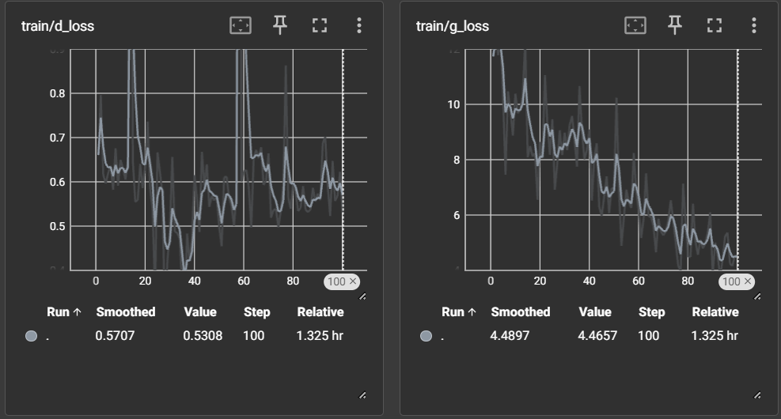
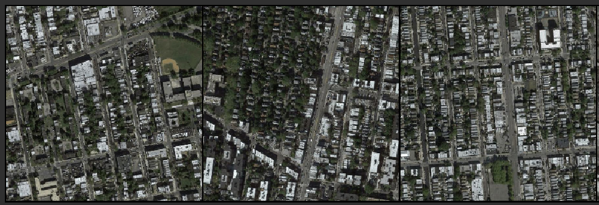
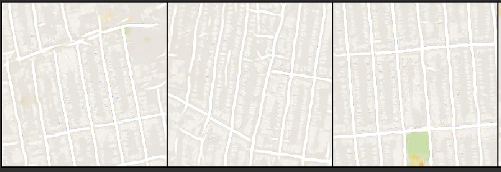
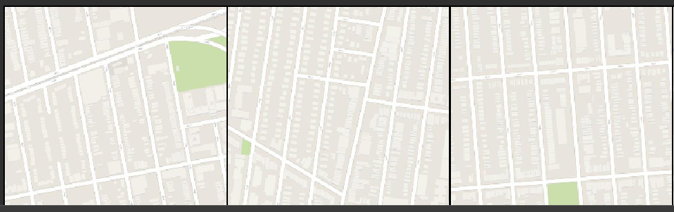

# Pix2Pix from Scratch in PyTorch

This repository contains the implementation of the Pix2Pix model from scratch using PyTorch. The Pix2Pix model is a conditional Generative Adversarial Network (cGAN) that learns a mapping from input images to output images. This project demonstrates the use of PyTorch and Ignite for training and logging purposes.

## Project Overview

- **Model:** Pix2Pix (cGAN)
- **Framework:** PyTorch
- **Dataset:** [Maps Dataset](https://www.kaggle.com/datasets/vikramtiwari/pix2pix-dataset) from Kaggle

### Dataset

The Maps dataset contains paired images of satellite photos and maps. This dataset is ideal for tasks like image translation, where the model learns to convert satellite images into map images and vice versa.

You can find and download the dataset from [Kaggle](https://www.kaggle.com/datasets/vikramtiwari/pix2pix-dataset).

### Training

- **Discriminator Loss (`d_loss`)**: Measures how well the discriminator distinguishes between real and fake images.
- **Generator Loss (`g_loss`)**: Measures how well the generator produces realistic images.

Below is the training dynamics graph showing the generator and discriminator losses over time for 100 epochs train.

 

### Results

The model was trained on the Maps dataset for 100 epochs. Below are some of the results on the validation set:

- **Input Image:** :

- **Generated Image:** The corresponding image generated by the Pix2Pix model :

- **Target Image:** The ground truth image :

### References
- Pix2Pix **original paper** link : [paper](https://arxiv.org/abs/1611.07004)

### Future Work

- Experimenting with different datasets for image-to-image translation.
- Fine-tuning the model for better performance.
- Exploring & Implementing advanced GAN techniques to improve image quality.

